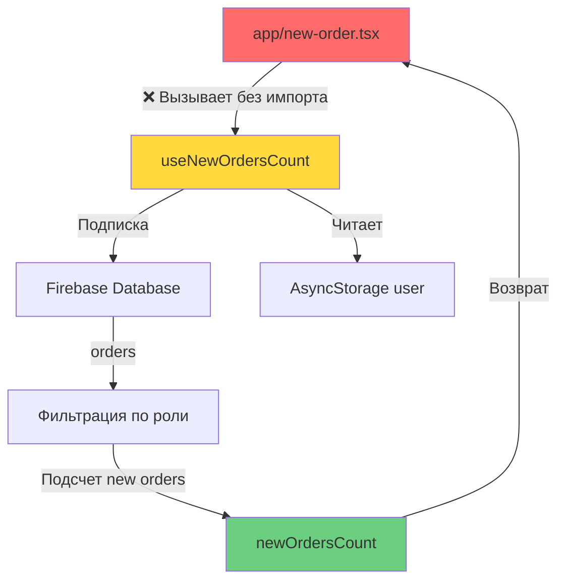

# План исправления ошибки useNewOrdersCount

## 🔍 Анализ проблемы

### Описание ошибки
```
ERROR [ReferenceError: Property 'useNewOrdersCount' doesn't exist]
```

### Причина
В файле [`app/new-order.tsx`](../app/new-order.tsx:30) на строке 30 используется хук `useNewOrdersCount()`, но:
1. **Отсутствует импорт** хука из модуля `@/hooks/useNewOrdersCount`
2. **Переменная не используется** нигде в коде компонента

### Текущее состояние кода

**Файл:** `app/new-order.tsx` (строка 30)
```typescript
const newOrdersCount = useNewOrdersCount(); // ❌ Нет импорта, переменная не используется
```

**Файл:** `hooks/useNewOrdersCount.ts`
```typescript
export const useNewOrdersCount = () => {
  // ... реализация хука
  return newOrdersCount;
};
```

### Результаты поиска
- Хук `useNewOrdersCount` используется **только в одном месте**: `app/new-order.tsx:30`
- Хук **нигде больше не импортируется** в проекте
- Переменная `newOrdersCount` **не используется** в компоненте `NewOrderScreen`

---

## ✅ Решение

### Вариант 1: Удалить неиспользуемый код (Рекомендуется)

Поскольку переменная `newOrdersCount` не используется в компоненте, самое простое и правильное решение — **удалить эту строку кода**.

**Действие:**
Удалить строку 30 в файле `app/new-order.tsx`:
```typescript
// Удалить эту строку:
const newOrdersCount = useNewOrdersCount();
```

**Преимущества:**
- ✅ Простое решение
- ✅ Убирает неиспользуемый код
- ✅ Улучшает производительность (не выполняются лишние Firebase запросы)
- ✅ Не требует дополнительных изменений

---

### Вариант 2: Добавить импорт и использовать хук

Если хук был добавлен с определенной целью (например, для будущего функционала), можно добавить импорт.

**Действие 1:** Добавить импорт в начало файла `app/new-order.tsx`:
```typescript
import { useNewOrdersCount } from '@/hooks/useNewOrdersCount';
```

**Действие 2:** Использовать переменную (например, для отображения бейджа):
```typescript
// В компоненте, где отображается колокольчик уведомлений (строка ~660)
{newOrdersCount > 0 && (
  <View style={styles.notificationBadge}>
    <Text style={styles.notificationBadgeText}>{newOrdersCount}</Text>
  </View>
)}
```

**Недостатки:**
- ⚠️ Требует дополнительной реализации UI
- ⚠️ Неясно, была ли это изначальная задумка
- ⚠️ Добавляет сложность без явной необходимости

---

## 🎯 Рекомендация

**Выбрать Вариант 1** — удалить неиспользуемый код.

### Обоснование:
1. Переменная не используется в текущей реализации
2. Хук выполняет Firebase запросы, что влияет на производительность
3. Если функционал понадобится в будущем, его легко добавить обратно
4. Следует принципу "YAGNI" (You Aren't Gonna Need It)

---

## 📋 Шаги реализации (Вариант 1)

### Шаг 1: Открыть файл
```bash
app/new-order.tsx
```

### Шаг 2: Найти и удалить строку 30
**Было:**
```typescript
export default function NewOrderScreen() {
  const insets = useSafeAreaInsets();
  const topJawScrollRef = useRef<ScrollView>(null);
  const bottomJawScrollRef = useRef<ScrollView>(null);
  const formScrollRef = useRef<ScrollView>(null);
  const newOrdersCount = useNewOrdersCount(); // ❌ Удалить эту строку

  useEffect(() => {
```

**Стало:**
```typescript
export default function NewOrderScreen() {
  const insets = useSafeAreaInsets();
  const topJawScrollRef = useRef<ScrollView>(null);
  const bottomJawScrollRef = useRef<ScrollView>(null);
  const formScrollRef = useRef<ScrollView>(null);
  // ✅ Строка удалена

  useEffect(() => {
```

### Шаг 3: Сохранить файл

### Шаг 4: Проверить работу приложения
- Запустить приложение
- Открыть экран "Новый наряд"
- Убедиться, что ошибка исчезла

---

## 🔄 Альтернативный сценарий

Если хук `useNewOrdersCount` должен использоваться для отображения количества новых заказов:

### Где может использоваться:
1. **В хедере приложения** — показать бейдж с количеством новых заказов
2. **На главном экране** — отобразить уведомление
3. **В табе поиска** — показать количество непрочитанных заказов

### Текущая реализация в других файлах:
Проверка показала, что в файле [`app/(tabs)/index.tsx`](../app/(tabs)/index.tsx) (главный экран) хук **не используется**, хотя там есть функция `playGlobalBell()` для воспроизведения звука уведомлений.

---

## 📊 Анализ хука useNewOrdersCount

### Что делает хук:
```typescript
export const useNewOrdersCount = () => {
  const [newOrdersCount, setNewOrdersCount] = useState(0);
  const [user, setUser] = useState<any>(null);

  // Получает текущего пользователя из AsyncStorage
  useEffect(() => {
    AsyncStorage.getItem('user').then((data) => {
      if (data) setUser(JSON.parse(data));
    });
  }, []);

  // Подписывается на изменения в Firebase и считает новые заказы
  useEffect(() => {
    if (!user) return;
    const ordersRef = ref(database, 'orders');
    const unsubscribe = onValue(ordersRef, (snapshot) => {
      // Фильтрует заказы по роли пользователя (doctor/technician)
      // Считает заказы со статусом 'new'
    });
    return () => unsubscribe();
  }, [user]);

  return newOrdersCount;
};
```

### Функционал:
- ✅ Получает текущего пользователя
- ✅ Подписывается на изменения заказов в Firebase
- ✅ Фильтрует заказы по роли (врач/техник)
- ✅ Считает только заказы со статусом 'new'
- ✅ Возвращает количество новых заказов

### Потенциальное использование:
Хук полезен для отображения количества новых заказов в реальном времени, но в текущей реализации экрана "Новый наряд" это не требуется.

---

## 🎨 Диаграмма архитектуры



---

## ✨ Итоговое решение

### Рекомендуемые действия:

1. **Удалить строку 30** в файле `app/new-order.tsx`:
   ```typescript
   const newOrdersCount = useNewOrdersCount();
   ```

2. **Сохранить файл** и перезапустить приложение

3. **Проверить**, что ошибка исчезла

### Если потребуется функционал подсчета заказов:

1. Добавить импорт:
   ```typescript
   import { useNewOrdersCount } from '@/hooks/useNewOrdersCount';
   ```

2. Использовать в нужном месте (например, в хедере или на главном экране)

---

## 📝 Заметки

- Хук `useNewOrdersCount` хорошо реализован и может быть полезен в других частях приложения
- Рекомендуется использовать его на главном экране или в глобальном хедере
- В текущей реализации экрана "Новый наряд" этот функционал не нужен

---

## 🚀 Следующие шаги

После исправления ошибки рекомендуется:

1. ✅ Проверить работу экрана "Новый наряд"
2. 🔍 Рассмотреть возможность использования хука на главном экране
3. 📱 Добавить визуальную индикацию новых заказов в навигации
4. 🔔 Интегрировать с системой уведомлений

---

**Дата создания:** 2026-05-29  
**Статус:** Готов к реализации  
**Приоритет:** Высокий (блокирующая ошибка)
